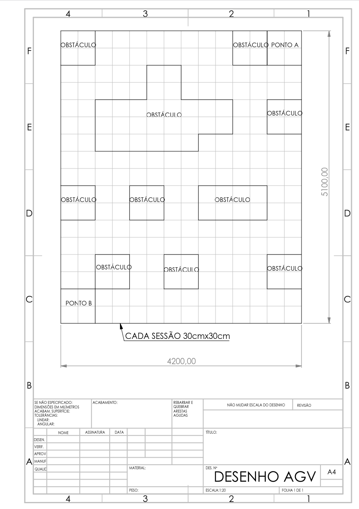
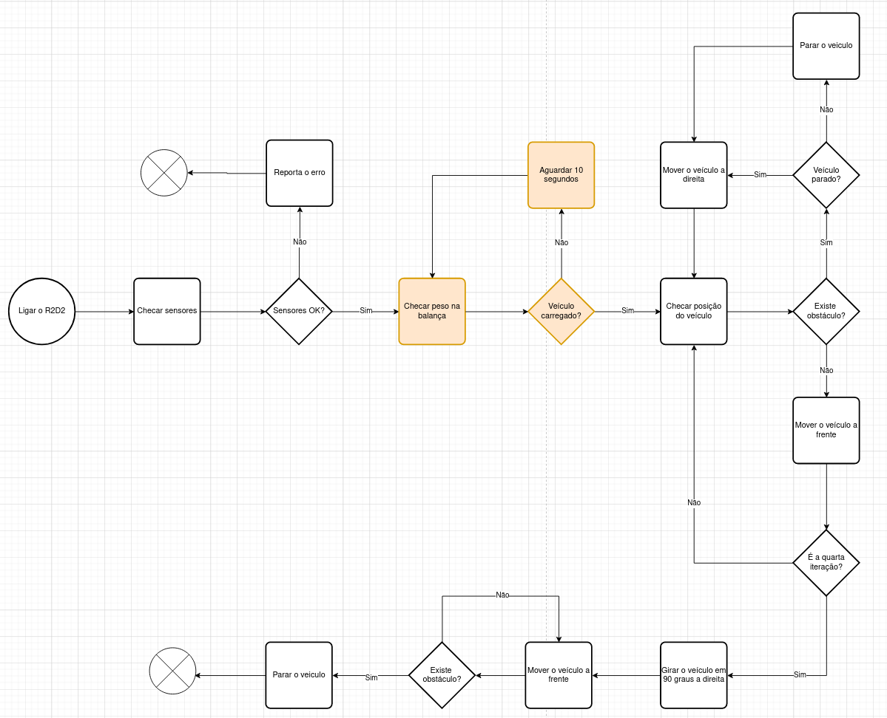
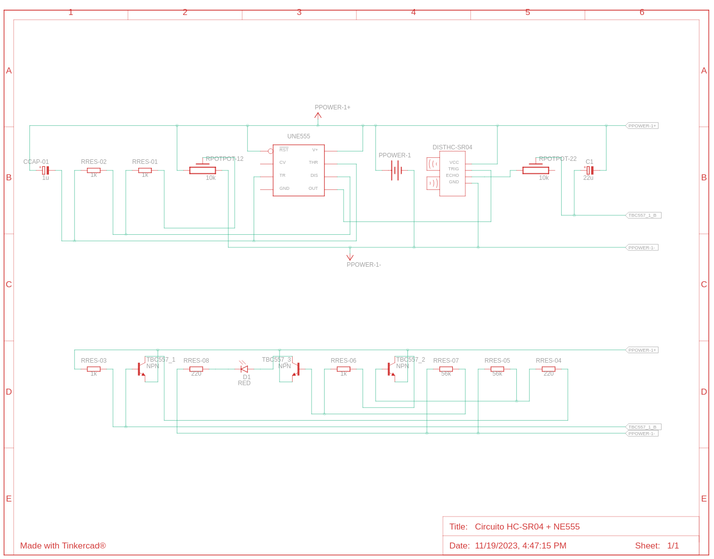
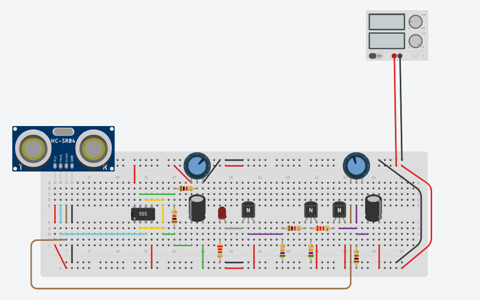

# R2D2
Projeto AGV tuma mista Mecatrônica e Fabricação Mecânica - Semestre 2/2023

Alunos:
 - Arikaue 
 - Charly Batista
 - Leonardo Bachtold
 - Victor Andrey
 - Vinicius Alves

Orientadores: 
  - Prof. Msc. Andrea Loureiro Andrade
  - Prof. Msc. Kleber Aluizo Isidorio Vaiz

## Proposta

Este projeto propõe-se a construir um veículo autônomo capaz de executar o trajeto descrito na imagem abaixo onde irá receber uma carga no "PONTO A" e entregar no "PONTO B". 

__[Circuito no qual o AGV deve executar as tarefas]__

Para resolver o problema proposto o R2D2 funcionará como uma maquina de estados finitos com os estados bem definidos conforme diagrama abaixo:

__[Diagrama de estados R2D2]__

Por um erro no design do protótipo (esquecimento de incorporar a balança no projeto) os estados em laranja não serão implementados nesta primeira fase do projeto.

Como parte dos requisitos nós precisamos utilizar os componentes abaixo disponibilizados pela instituição

  - Arduino Uno: 1
  - Motor DC: 4
  - Motor Shield L293d (Driver Ponte H): 1
  - Sensor Ultrassônico de Distância HC-SR04: 1

Nós optamos por utilizar um circuito independente para controlar o sensor HC-SR04 como descrito no esquemático abaixo:

__[Diagrama esquemático do circúito HCSR-04 usando um NE555 como gerador de pulso]__

__[Diagrama esquemático do circúito HCSR-04 usando um NE555 como gerador de pulso]__

## Dependeces 

The external libraries we use in this project are listed below:

  - PinChangeInt: Biblioteca que permite utilizar qualquer pino no Arduino pra responder a interrupções externas
  - Adafruit Motor Shield library: Utilizada para auxiliar no controle dos motores DC